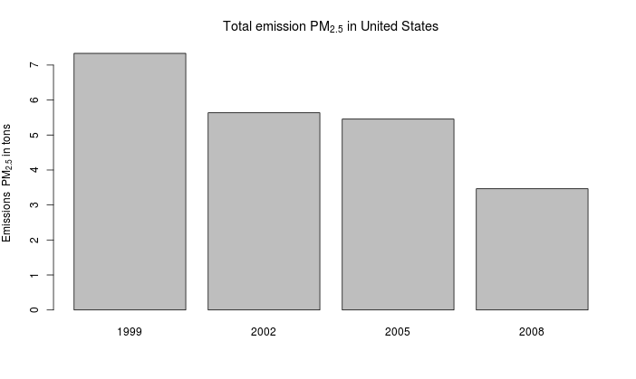
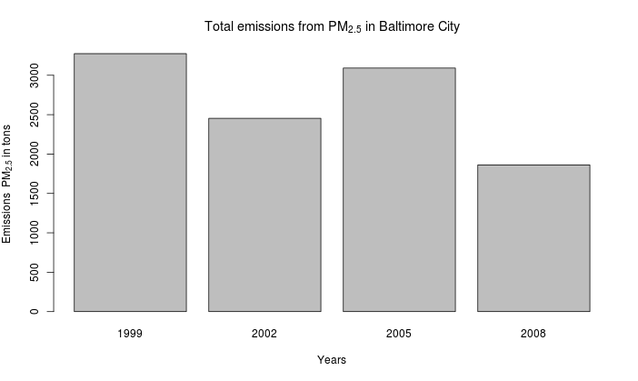
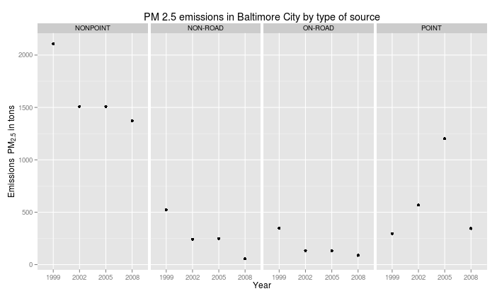
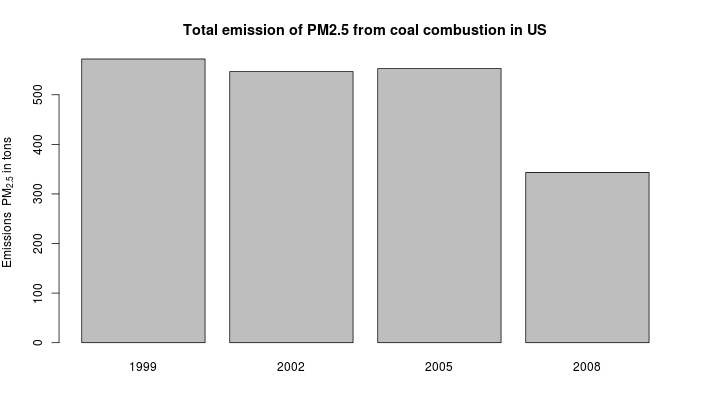
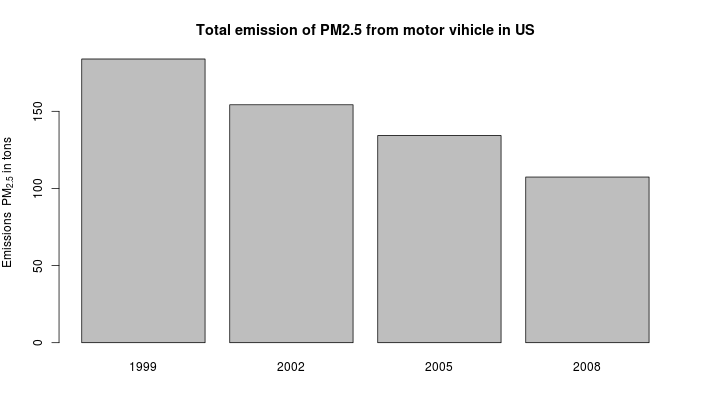
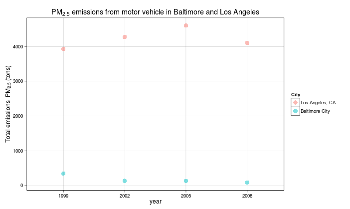

Plotting Assignment 2 for Exploratory Data Analysis

Introduction
------------
Fine particulate matter (PM 2.5 ) is an ambient air pollutant for which there is strong evidence that it is
harmful to human health. In the United States, the Environmental Protection Agency (EPA) is tasked with
setting national ambient air quality standards for fine PM and for tracking the emissions of this pollutant
into the atmosphere. Approximatly every 3 years, the EPA releases its database on emissions of PM 2.5.
This database is known as the National Emissions Inventory (NEI). You can read more information about
the NEI at the EPA National Emissions Inventory web site
(http://www.epa.gov/ttn/chief/eiinformation.html).
For each year and for each type of PM source, the NEI records how many tons of PM 2.5  were emitted
from that source over the course of the entire year. The data that you will use for this assignment are for
1999, 2002, 2005, and 2008.

Data
The data for this assignment are available from the course web site as a single zip file:
Data https://d396qusza40orc.cloudfront.net/exdata%2Fdata%2FNEI_data.zip)

Assignment
==========
The overall goal of this assignment is to explore the National Emissions Inventory database and see what
it say about fine particulate matter pollution in the United states over the 10?year period 1999 to 2008.

Questions
---------
1. Have total emissions from PM 2.5  decreased in the United States from 1999 to 2008?

2. Have total emissions from PM 2.5  decreased in the Baltimore City, Maryland from 1999 to 2008?

3. Of the four types of sources indicated by the  type  (point, nonpoint, onroad, nonroad) variable, which
of these four sources have seen decreases in emissions from 1999 to 2008 for Baltimore City? Which
have seen increases in emissions from 1999 to 2008?

4.Across the United States, how have emissions from coal combustion?related sources changed from
1999 to 2008?

5. How have emissions from motor vehicle sources changed from 1999 to 2008 in Baltimore City?

6. Compare emissions from motor vehicle sources in Baltimore City with emissions from motor vehicle
sources in Los Angeles County, California. Which city has seen greater
changes over time in motor vehicle emissions ?

The motor vehicle sources was subset from the variable name "EI.Sector" from de data frame using grep("Mobile - On-Road") according to the 2011 National Emissions Inventory, version 1 Technical Support Document page 215 section 4.6 it include:

        1. Mobile – On-road – Diesel Heavy Duty Vehicles
        2. Mobile – On-road – Diesel Light Duty Vehicles
        3. Mobile – On-road – Gasoline Heavy Duty Vehicles
        4. Mobile – On-road – Gasoline Light Duty Vehicles

